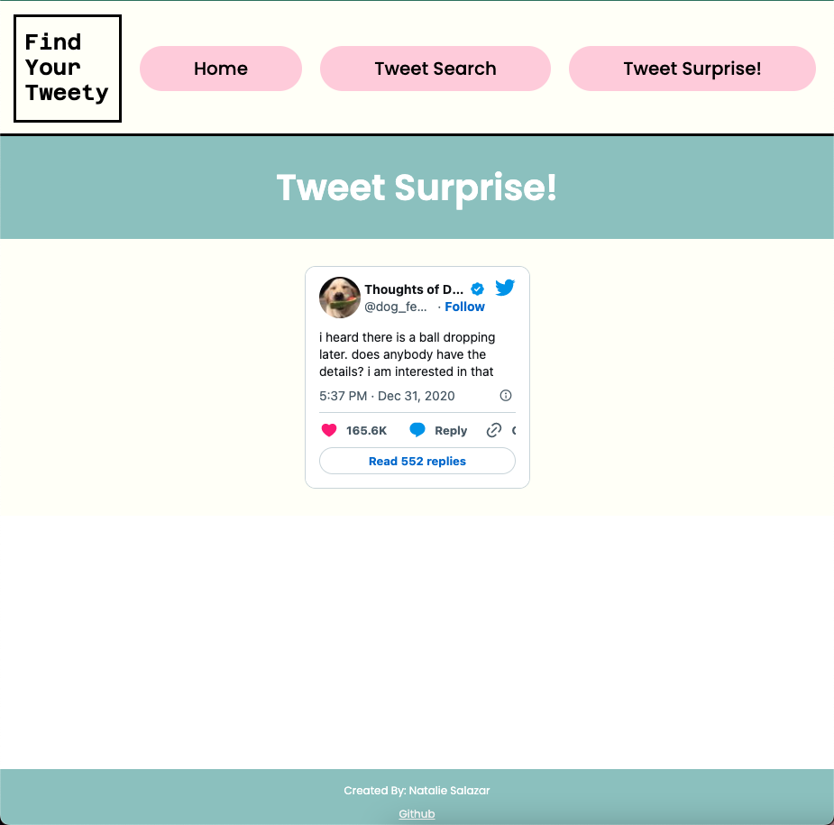

# Find Your Tweety!

## UPDATE: Due to the changes in Twitter Developer Platform payment tiers, Find Your Tweety no longer can search or display tweets or users. The app is not non-functional and exists purely as a GitHub piece for my portfolio.

 
Find Your Tweety (FYT) is your new off-platform search engine to find the most recent Twitter Tweets by content, user timelines, hashtags, and user mentions. There's also a Tweet Surprise! page that showcases a random tweet from one of my top 5 favorite Twitter handles!
 

[Click here to to use!](https://find-your-tweety.herokuapp.com/)

 

### Home Page

### Tweet Search

### Tweet Surprise!

 

## Summary

Find Your Tweety utilizes a ReactJS+CSS front end and data retrieval handled by Flask+Python to make requests to the Twitter 1.1 API according to user search criteria. React Router is used to navigate between pages and React Router Form is used to manage user search input. This project is deployed jointly on Heroku using a Python webpack that is configured to serve up the React front end simultaneously so that they can both operate off of the same server to avoid CORS issues.

The purpose of this project was to learn how to use Python Flask to build an API that can retrieve data from a database (another API in this instance(=) using a series of authorizations and parameters to then feed up to a front end for client use. I learned a lot about how different levels of stacks communicate to one another and why compartamentalized, streamlined, and easy-to-read code is easier to build and maintain. This project also gave me a chance to practice with React Router, and to hone my skills using React functional components even more. By deploying via a Python webpack on Heroku, I also had the chance to learn more about how full stack web applications are configured for deployment on a remote server via requirements.txt files, webpack file configurations, and the role of virtual environments for development.

 

## Installation

### Front-end

1. From root directory run `npm install`
2. Run `npm start`

### Back-end

1. Open up separate terminal
2. Run `cd api`
3. Run `py -m venv .venv`
4. Run `source venv/bin/activate`
5. Run `pip install -r ../requirements.txt`
6. Create .env file and add key value pair `BEARER_TOKEN = XXX`
7. Run `flask run`

Author

- **Natalie Salazar** - Software Developer [LinkedIn](https://www.linkedin.com/in/natalie-m-salazar/)
